Rang
====

Rang is a JPEG steganography algorithm, that uses a reversible hash function on a whole image to extract data.

The main goal of the algorithm is to achieve undetectability without a secret password. The security of the algorithm relies on indistingushability of the embedded data from uniform randomness. It can be coupled with symmetric encryption, as well as with asymmetric cryptographic containers - with no previously shared secret.

Extraction process:

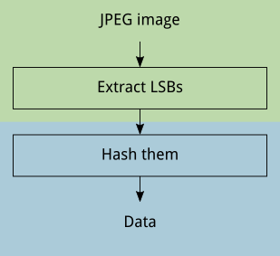

Embedding process:

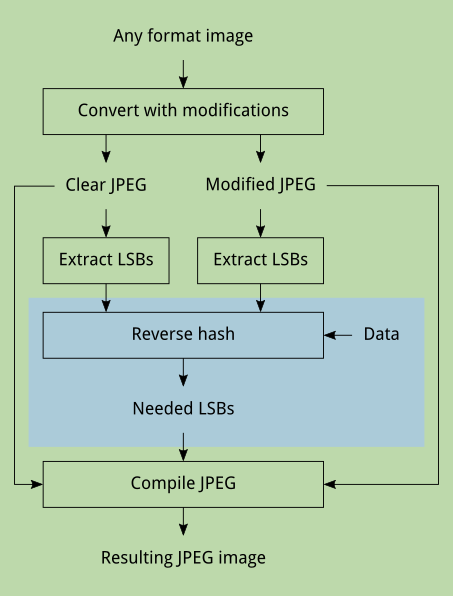

The algorithm consists of two parts: Rang-JPEG (the green area) and Rang-Hash (the blue area). The latter is indepenent from the JPEG format and can be applied to other media types, provided that there is a corresponding green part.

Rang-JPEG
---------

The algorithm works with the least significant bits of DCT coefficients of the first (greyscale) colour component of an image.

The extracting part is easy: obtain the LSBs and pass them to the hash function. The hash function returns the embedded data. It can produce output of any requested length, possibly infinite, so it's a responsibility of the data format to indicate, where to cut the hash.

The reverse hash function requires the data to embed and two alternative LSB arrays. It constructs the resulting array, replacing some of the items of the first array with the corresponding items from the second. This returned array has the desired hash.

### Image modifications

An important feature of that reverse hash function is that it doesn't care about the way the image gets modified. It only needs to know, which of the LSBs can be changed, while there are many options to change them: it can be simple invertion of LSB values, increment or decrement of a whole coefficient value, or some more complicated method.

The general algorithm requires two JPEG files with unnoticeable differences. When a coefficient in the first image has to be changed, it's replaced with the corresponding coefficient from the second.

The [reference implementation](https://github.com/Kleshni/Cover) creates the first image by plain reencoding from any format to JPEG, and derives the second image, merging the original with its 99 % trasparent copy after Gaussian blur with a radius of 0,1 pixel. If the absolute difference between a clear and a modified coefficient exceeds 1, the modified coefficient is adjusted.

This method doesn't touch same colour areas, making changes only on object edges, and has an advantage over raw coefficients modification: it goes though JPEG block boundaries. It also changes coefficients in both directions, not only decreasing their absolute values like in the [F5](https://code.google.com/p/f5-steganography/) algorithm, and doesn't treat 1 and -1 coefficients specially.

Original PNG (242 by 360 pixels):


Converted to JPEG with 95 % quality before and after the blur:

 

Their pixel difference:

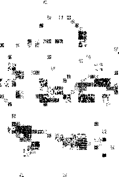

They have 497 different coefficients. 222 negative coefficients of the first image can be changed in two directions:

```
-1: 97
+1: 125
```

222 positive coefficients:

```
-1: 175
+1: 47
```

And 32 zeroes:

```
-1: 21
+1: 14
```

### Improvements

This method of image distortion with Gaussian blur gives too little container capacity, and it's of course not the most secure method possible.

Fortunately, it can be replaced at any time, preserving full compatibility with working extractors.

Rang-Hash
---------

The hash function's input is an array of bits. The function associates with each input bit a long pseudorandom byte string and calculates the output by xoring all of the strings, which correspond to non-zero bits.

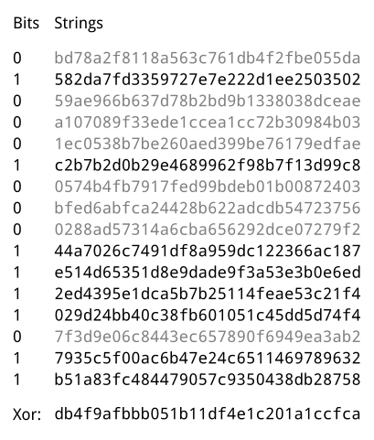

The strings are constant and not secret, their pseudorandomness means only uniform distribution. The reference implementation creates them using Salsa20/12-256 with a zero key and nonce values equal to indexes of the bits in the input array, so each bit has an associated PRNG.

### Reverse hash

The reverse hash function requires an array of current bit values and a list of available modifications.

The hash function can be decomposed into two separate xors of strings, representing modifiable and non-modifiable coefficients:

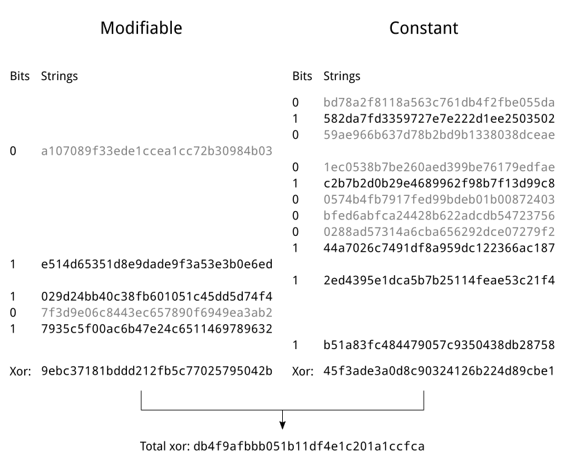

```
H = M ^ C
```

Only the `M` value can be altered in order to change the hash value:

```
D = M' ^ C
```

Where `D` is the data to embed. It's possible to eliminate `C`:

```
C = H ^ M
D = M' ^ (H ^ M)
D ^ H = M ^ M'
```

So the problem is to find such combination of strings from the modifiable subset, whose xor equals the known value of `D ^ H`, and modify their coefficients:

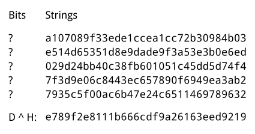

#### Matrix multiplication

The problem can be rewritten in terms of bit matrixes with the xor operation instead of the usual addition:

```
a = b * S
```

Where:
- `a` is the bit vector `D ^ H`;
- `b` is the needed vector of bits from the left column of the scheme;
- `S` is the matrix, made from the pseudorandom strings.

If the lengths of `a` and `b` are equal and `S` is non-singular, the solution is easy:

```
b = a * invert(S)
```

But in general the count of modifiable coefficients should be much greater than the length of the data to embed, so `b` is longer than `a` and the matrix is not square.

#### Submatrix

To make a square from a high matrix `S`, some of its rows must be deleted and corresponding bits in `b` must be set to zero.

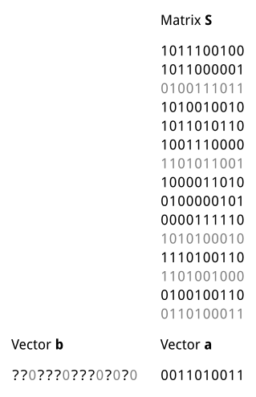

Which rows to delete should be chosen at random. This is analogous to pseudorandom permutations in other steganography algorithms, it achieves the same purpose: to scatter the changes over the image. But the extracting side doesn't need to know, which rows were chosen, so a secret password is not needed.

The only requirement for the submatrix `S'` is that it must be non-singular, so that the unknown bits of the vector `b` can be found:

```
b' = a * invert(S')
```

#### Submatrix extension

One way to find a non-singular submatrix is to test them in a loop. If a submatrix is singular, choose another one and test again.

But a more effective way is to do Gaussian elimination on an extended submatrix with additional rows.

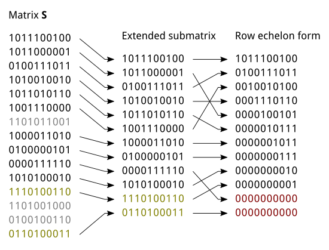

The rows, that become zero after the elimination, must be excluded from the extended submatrix to get a non-singular square.

Of course, there is a probability for the extended submatrix to have insufficient rank, but it quickly decreases with the number of additional rows. 24 additional rows rise success probability above 0,99999994 (see [`probability.py`](probability.py)).

And it's not necessary to choose the additional rows in advance, they can be added to the matrix during the elimination process.

#### Random padding

Since the submatrix must be non-singular, the attacker knows, which coefficient combinations couldn't be chosen. Moreover, excluded rows usually gather near the bottom of the matrix if the elimination algorithm always takes the first available pivot.

Maybe this redundancy can't significantly help the attacker, but it's possible to hide it from them completely.

To accomplish this the submatrix should be extended with a fixed number of rows, chosen in advance, but the excluded rows after the elimination must be remembered.

Now the rows of the full matrix `S` are divided into three types:
- unused rows;
- used rows, that form the submatrix `S'`;
- and rows, excluded after the elimination.

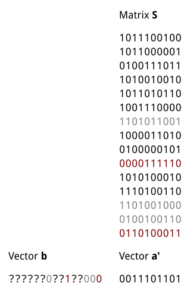

As mentioned above, the bits in the vector `b`, which correspond to the unused rows, must be set to 0. But the bits, corresponding to the excluded rows, must be set to random values. And if a particular bit is set to 1, the vector `a` must be xored with the corresponding row.

The unknown bits of `b` are calculated as before, but from the modified `a`:

```
b' = a' * invert(S')
```

This complication guarantees, that the set of affected coefficients is independent from the submatrix properties, except the size. Every chosen coefficient is changed with exact 50 % probability if the embedded data is random, because there is a bijection between the data and `b'`, and other chosen bits in the full `b` are set to random values.

### Blocks

The hash function's complexity grows with `n * m`, where `n` is the output length and `m` is the size of the image. The reverse hash function requires `n ** 3` (using naive Gaussian elimination).

Embedding of 2 kiB on a 3 GHz x86-64 CPU takes 32 seconds. It can be optimized with SSE, multiple cores or GPGPU, but a simpler solution is to divide the data into smaller blocks.

#### Independent blocks

The easiest option is to divide the image's coefficients into two or more blocks and to use them for different parts of the data.

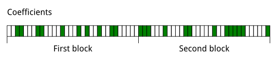

A fundamental problem of this method is that the extracting side have to know the number, sizes and positions of the blocks. This information must be stored somewhere or guessed by the extractor.

#### Nested blocks

Instead of embedding the second block into the last half of the image, embed it into the whole image.

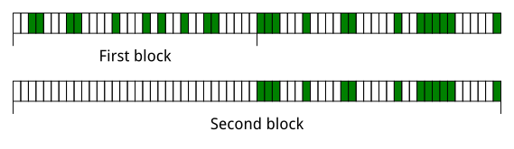

After embedding of the first block all coefficients of the first half become unmodifiable, but they still can be a part of the second block like other unmodifiable coefficients.

The first block can have an arbitrary size and position, this information must be stored in the second block under encryption. The extraction process now transforms to:
- hash the whole image to extract the second block;
- decrypt it and read the size and position of the first block;
- hash the corresponding part of the image and get the first block.

This method can recursively expand to three or more blocks, each one nesting all previous, but it's not necessary. Only the last block needs to include all other, because it must have fixed size and position to be extractable, other blocks can be embedded without nesting.

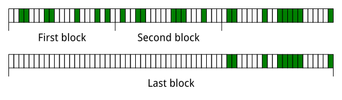

#### Padding collapse

The number of modifiable coefficients can vary among the blocks, so they can have different capacities and, which is dangerous for undetectability, different densities of changes.

To prevent this the separation into blocks must be based on modifiable coefficients. And since not all of them are actually needed, depending on the data size, the separation must occur after random subset selection.

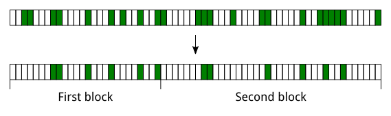

The size of the subset is known in advance: it consists of the bit sizes of all blocks. The bit size of a block is determined by its data size + padding bits.

But while one block requires 24 padding bits, two blocks together need only 29 for at least the same success probability if unused extension rows from the bottom of the first block's matrix are recycled in the second (see [`probability.py`](probability.py)).

After embedding of all blocks, some coefficients of the selected subset may remain unused, they should be changed at random to keep the density of changes uniform.

#### Implementation

This method of blocks nestring needs interactive assistance from the embedded data format, so it's not supported in the console line interface of the reference implementation, but necessary functions are provided in the library.

### Changes optimization

The proposed reverse hashing algorithm spends too many modifiable coefficients. It changes about 1 coefficient for 2 embedded bits of data. This can be optimized.

Instead of selecting a submatrix, do Gaussian elimination on the whole matrix `S`:

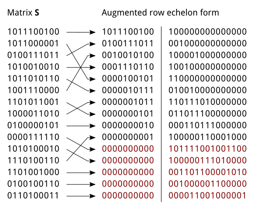

And calculate the needed vector `b` from `a` and the result of the elimination. The vector `a` determines, which rows of the right side of the augmented matrix must be xored to get the result, but it's too short, it covers only the top of the matrix.

It means, that the bottom rows don't affect the embedded data, but they still affect the vector `b`. They can be used to minimize the count of set bits in the vector `b` - to lower the changes rate.

Using the example matrix `S`, the same data, encoded in the vector `a = 0011010011`, can be embedded in the image with different vectors `b`:

```
1.  000001001001000
2.  000010000001001
3.  001001000101000
4.  000100100100010
5.  101110000000100
6.  001100101000010
7.  100001110011000
8.  101100010010010
9.  100110001100100
10. 000000010011111
11. 001010001101001
12. 100101000100101
13. 100011100001110
14. 000110110110100
15. 100100011110010
16. 101101001000101
17. 001111100000011
18. 100000101001111
19. 001110111010100
20. 000011011011110
21. 100010111011001
22. 001101110010101
23. 000111101100011
24. 101000100101111
25. 101001111111000
26. 001011010111110
27. 101010110111001
28. 000101111110101
29. 100111010110011
30. 001000011111111
31. 101011101101110
32. 101111011010011
```

There are two options to embed 10 bits of the data with 3 changes instead of average 5.

The optimization is limited only by the number of excess coefficients and computational resourses, because I don't know, how to find optimal vectors `b` faster than with exhaustive search.
